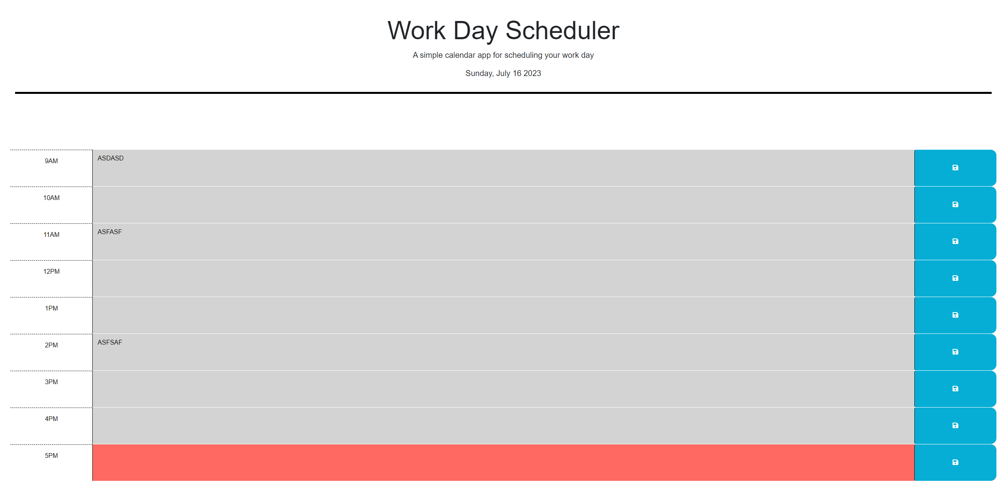

# Work Day Scheduler Starter Code

## Description

This is a day planner for the busy worker!  You can add events to the planner and they will stay even after the page is refrehed.  The text field will be gray if that time block is in the past, red if during the present, and green if in the future.

https://bpoole53.github.io/day-planner-mod-5/

## Installation

N/A

## Usage

The user enters text in the the text field for the appropriate time.  They then click the save icon to save the text to local storage.  A message will pop up to ensure the user is aware that the save went through.

## Credits

N/A

## License

N/A
